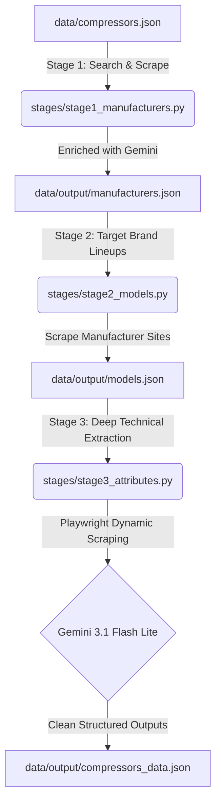

# Compressor Data Crawler — Technical & Functional Documentation

Welcome to the **Compressor Data Crawler** project! This document provides a complete, developer-friendly guide explaining both the functional and technical aspects of the pipeline. It is designed to get a new developer fully onboarded and up to speed.

---

## 📖 Executive Summary

Industrial compressors (Air, Refrigeration, Gas, Superchargers, and Medical) are complex machines with highly specific technical specifications. Finding structured data for these products is difficult because manufacturer websites present specifications in diverse formats (static text, dynamic JavaScript-rendered tables, or PDF brochures).

This project is an **intelligent, automated 3-stage data extraction pipeline** that:
1. Discovers top manufacturers for different compressor types.
2. Discovers specific model lineups for those manufacturers.
3. Crawls individual product pages to extract and structure **30+ engineering attributes** into a clean, flat JSON database.



---

## 🛠 Technology Stack & Libraries

To build a highly robust, professional crawler, we avoided basic scrapers and selected modern, resilient libraries. Below is the dependency breakdown:

| Dependency | Purpose | Technical Rationale (Why this was chosen) |
| :--- | :--- | :--- |
| **`google-genai`** | Core Gemini AI Engine | Modern Google GenAI SDK. Replaces the deprecated `google-generativeai` package. Supports stable Gemini 3.1/2.0 families and features like native **Structured Outputs** (`response_mime_type`) and advanced safety adjustments. |
| **`tavily-python`** | LLM-Optimized Search | Standard search engines return massive, noisy HTML bodies. **Tavily** is explicitly designed for AI agents, returning clean, parsed textual content and direct links, dramatically lowering token costs. |
| **`playwright`** | Headless Browser Scraper | Industrial product pages are heavily dependent on dynamic JavaScript (e.g., React/Vue tables). Static scrappers return empty shells. **Playwright** spins up a headless Chromium instance, waits for the DOM to load, and extracts the fully rendered spec sheet. |
| **`httpx`** | Static Scraper Engine | Used for fast, lightweight fetching of static pages. It is significantly faster than standard `requests` and has robust asynchronous execution capabilities. |
| **`beautifulsoup4` & `lxml`** | HTML Parser | Quickly and efficiently parses and cleans HTML structures, stripping script/style tags and yielding clean text blocks for Gemini. |
| **`tenacity`** | Advanced Retry Logic | Rate limits, network drops, and occasional malformed API payloads are inevitable. **Tenacity** wraps our execution, automatically retrying with exponential backoff on both connection limits and parsing exceptions. |
| **`python-dotenv`** | Secrets Management | Safely loads sensitive API keys (`GEMINI_API_KEY`, `TAVILY_API_KEY`) from a local `.env` file, keeping credentials secure and isolated from source code. |
| **`tqdm`** | UI Visual Feedback | Renders highly detailed, visual console progress bars so developers can track the crawling process in real time. |

---

## 🔄 Architectural & Data Flow Breakdown

The project operates sequentially across **3 core stages**. Each stage saves its output, allowing the pipeline to be resumed from any midpoint.

---

### 📦 Stage 1: Manufacturer Discovery

* **Code:** `stages/stage1_manufacturers.py`
* **Functional Goal:** Find the leading global brands for each category listed in `data/compressors.json` (e.g., identifying Atlas Copco, Ariel Corp, Bauer, etc.).
* **Technical Details:**
  1. Reads `data/compressors.json` to extract compressor types, applications, and subtypes.
  2. Constructs a highly optimized search query: `"{type}" manufacturers brands companies top global list`.
  3. Queries the **Tavily Search API** to fetch top ranked websites.
  4. Scrapes search content and forwards it to Gemini to extract clean records: `name`, `country`, and `website` (domain only).
  5. **Knowledge Fallback:** If search results fail or are empty, Gemini is prompted directly for its native technical knowledge to prevent pipeline stalls.
  6. **Output:** Saves results to `data/output/manufacturers.json`.

---

### 📦 Stage 2: Model Discovery

* **Code:** `stages/stage2_models.py`
* **Functional Goal:** For each discovered brand, find the specific product model numbers and their page URLs.
* **Technical Details:**
  1. Loads `data/output/manufacturers.json`.
  2. Builds domain-specific search queries using Google operators: `"{manufacturer} official {compressor_type} product models lineup site:{website.domain}"`.
  3. Fetches search listings and scans for product catalog landing pages.
  4. Scrapes landing pages and utilizes Gemini to parse a clean list: `model_name`, `series`, and `product_url`.
  5. Validates results by stripping out generic categories or non-model strings.
  6. **Output:** Saves results to `data/output/models.json`.

---

### 📦 Stage 3: Attribute Extraction

* **Code:** `stages/stage3_attributes.py`
* **Functional Goal:** Deep specification harvesting. For each discovered model, crawl its product page and parse the complete engineering datasheet.
* **Technical Details:**
  1. Loads `data/output/models.json`.
  2. Scrapes the model's product page using **Playwright headless Chromium** with `domcontentloaded` wait limits for speed and reliability.
  3. Pre-filters binary/PDF links (silently skips `.pdf/.zip/.xlsx` downloads).
  4. Feeds cleaned webpage text into Gemini along with a highly specific, flat schema containing **30+ standard attributes** (power, capacity, pressure, lubrication, noise, etc.).
  5. Enforces valid, structured JSON output natively at the LLM level.
  6. **Output:** Saves the final, consolidated database to `data/output/compressors_data.json`.

---

## 🛠 Key Robustness & Design Patterns

To ensure production-grade performance on free-tier APIs, the project implements several critical design patterns:

### 1. Model Quota Splitting
Google AI Studio places extremely strict quotas on preview models (`gemini-2.5-flash` / `gemini-2.0-flash`), capping requests at **20 requests/day**. 
* **Fix:** We configured the project to use **`gemini-3.1-flash-lite`**. This model is extremely fast, highly capable, and operates on a separate stable daily quota of **1,500 requests/day**, allowing the pipeline to execute hundreds of pages seamlessly.

### 2. Native Structured Outputs
To prevent parsing errors, the Gemini configuration strictly enforces:
```python
GenerateContentConfig(
    temperature=0.1,
    max_output_tokens=2048,
    response_mime_type="application/json"
)
```
This forces the Gemini API to output *only* syntactically valid JSON (objects or arrays), completely bypassing markdown wrapping fences (```json) or conversational text.

### 3. Integrated Tenacity Retries for JSON Parsing
Normally, tenacity only retries API errors. If Gemini successfully returns a string that fails `json.loads()` (e.g., due to truncation or special chars), standard code would crash.
We designed a unified retried wrapper:
```python
@retry(
    stop=stop_after_attempt(6),
    wait=wait_exponential(multiplier=2, min=10, max=60),
    retry=retry_if_exception(_should_retry),
)
def generate_json(prompt: str) -> dict | list:
    # API Call and parsing are located inside the retry block
    raw_text = _client.models.generate_content(...)
    return json.loads(_clean_json(raw_text))
```
This guarantees that if Gemini ever outputs malformed JSON, **tenacity catches the `JSONDecodeError` and automatically triggers a fresh API retry**, giving the crawler exceptional resilience.

### 4. Smart Politeness & Rate-Limit Evasion
Free tiers limit requests to **15 RPM (Requests Per Minute)**. To avoid hitting this ceiling:
* We set `REQUEST_DELAY_SECONDS=4.0` in `.env` to space out consecutive crawls.
* The tenacity wait exponential uses `min=10`, allowing the API to cool down when rate limited.

### 5. File-Based Scraper Caching
To minimize API consumption and search costs, a robust file cache is maintained in `data/cache`. The crawler hashes search and URL fetch inputs, caching responses locally on disk.

---

## 📁 Directory Structure

```
D:\apps\AI\Pump\
├── main.py                     # Pipeline Entry Point & CLI
├── config.py                   # Central settings loaded from .env
├── requirements.txt            # Python dependencies
├── .env                        # Private API keys and limits configuration
├── data/
│   ├── compressors.json        # MASTER INPUT: List of compressor types (JSON)
│   ├── cache/                  # Disk caching directory for parsed HTML/responses
│   └── output/                 # Final Structured Database outputs
│       ├── manufacturers.json  # Discovered manufacturers list
│       ├── models.json         # Discovered manufacturer model list
│       └── compressors_data.json # FINAL OUTPUT: Enriched attributes spec sheets
├── stages/
│   ├── stage1_manufacturers.py # Stage 1 Orchestration code
│   ├── stage2_models.py        # Stage 2 Orchestration code
│   └── stage3_attributes.py    # Stage 3 Orchestration code
└── utils/
    ├── web_search.py           # Tavily and DuckDuckGo search wrappers
    ├── scraper.py              # BeautifulSoup (static) & Playwright (dynamic) scrapers
    ├── genai_extractor.py      # Structured Gemini JSON extraction wrappers
    └── cache.py                # File system hashing cache engine
```

---

## 🚀 Getting Started (Onboarding Guide)

To run the project on your machine, follow these simple steps:

### 1. Environment Setup
Create a virtual environment and install the required dependencies:
```powershell
python -m venv venv
.\venv\Scripts\Activate
pip install -r requirements.txt
playwright install chromium
```

### 2. Configure Credentials
Copy `.env.example` to `.env` and fill in your keys:
```env
GEMINI_API_KEY=your_gemini_api_key_here
TAVILY_API_KEY=your_tavily_api_key_here (optional, falls back to DDG)
REQUEST_DELAY_SECONDS=4.0
CACHE_ENABLED=true
```

### 3. Execution Commands
```powershell
# Run connection test to verify APIs are live
python test_connections.py

# Run the full pipeline for all categories (uses cached pages if available)
python main.py

# Disable caching to force a clean, fresh crawl of the web
python main.py --no-cache

# Run only a specific compressor type (e.g. "Air")
python main.py --type "Air"

# Run only a specific pipeline stage
python main.py --stage 1
```

All scraped product data will be beautifully structured and saved right inside [compressors_data.json](file:///D:/apps/AI/Pump/data/output/compressors_data.json)!
