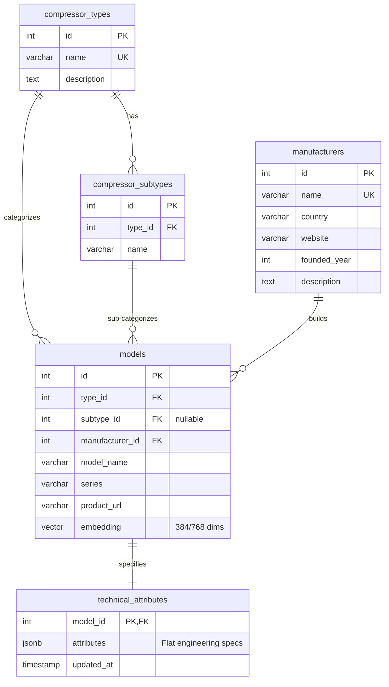

# Implementation Plan — Scaling to PostgreSQL, RAG, and Vue 3 + Vuetify

This plan outlines the architecture, technology stack, and step-by-step roadmap to scale the Compressor Data Crawler into a production-grade enterprise application.

---

## 📖 System Architecture

We will transform the single-run crawler script into a modern **three-tier web application**:

```
 ┌─────────────────────────────────────────────────────────┐
 │                  Vue 3 + Vuetify SPA                    │  ◄── Frontend (Vite)
 └────────────────────────────┬────────────────────────────┘
                              │ HTTP REST / WebSockets
                              ▼
 ┌─────────────────────────────────────────────────────────┐
 │                   FastAPI Web Server                    │  ◄── Backend (Python)
 └──────────────┬─────────────────────────────┬────────────┘
                │                             │
                ▼                             ▼
 ┌─────────────────────────────┐       ┌───────────────────┐
 │    PostgreSQL 18 DB         │       │ Background Task   │  ◄── Playwright Crawler
 │    (pgvector + JSONB)       │       │ Orchestration     │
 └─────────────────────────────┘       └───────────────────┘
```

---

## 🛠 Technology Stack & Libraries

### 1. Database Layer: PostgreSQL 18
* **`pgvector`**: PostgreSQL extension for vector storage and similarity searches.
* **`SQLAlchemy` (v2.0)**: Production-grade SQL Toolkit and Object-Relational Mapper (ORM).
* **`Alembic`**: Database migrations manager.

### 2. Backend Layer: Python FastAPI
* **`FastAPI`**: High-performance, async-native web framework.
* **`google-genai`**: Continued use of Gemini for both technical data extraction and generating semantic vector embeddings (`models/text-embedding-004`).
* **`uvicorn`**: High-performance ASGI web server.

### 3. Frontend Layer: Vue 3 + Vuetify 3
* **`Vue 3` (Composition API)**: Modern, reactive web framework built with Vite.
* **`Vuetify 3`**: Premium Material Design UI component library.
* **`Axios`**: Promise-based HTTP client for API interactions.
* **`Pinia`**: Lightweight state management store.

---

## 🗄 Database Schema Design

We will implement a relational structure with a dynamic `JSONB` spec sheet column to handle sparse technical attributes efficiently:



> [!TIP]
> **Why JSONB for Technical Attributes?**
> Compressor attributes (e.g. `rod_load_lbs` for gas compressors, `tank_size` for air compressors, and `volute_diameter` for superchargers) are extremely sparse and type-specific. A static column schema would result in 50+ columns containing 90% nulls. **PostgreSQL JSONB** allows storing flexible schemas while supporting index-accelerated queries.

---

## 🧠 RAG & Vector Semantic Deduplication

To prevent duplicate searches and API consumption, we will integrate a **Retrieval-Augmented Generation (RAG) guardrail** during Stage 2 & 3:

1. **Embedding Generation:**
   * When discovering a model, build a text string: `"{manufacturer} {compressor_type} model {model_name}"`.
   * Generate a vector embedding using Gemini (`client.models.embed_content`).
2. **Semantic Search:**
   * Search PostgreSQL using `pgvector` operators to calculate Cosine Distance (`<=>`):
     ```sql
     SELECT id, model_name, (1 - (embedding <=> :query_embedding)) AS similarity
     FROM models
     WHERE manufacturer_id = :mfr_id AND type_id = :type_id
     ORDER BY embedding <=> :query_embedding LIMIT 1;
     ```
3. **Decision Logic:**
   * **Exact match OR Semantic similarity > 0.92:** Skip the web search, scrapper, and Gemini spec extraction entirely. Serve the data directly from the `technical_attributes` table.
   * **New Data:** Run Playwright spec extraction, save the extracted specs to `technical_attributes`, generate the embedding, and insert it into `models`.

---

## 💻 Proposed Project Structure

We will transition the codebase to separate Backend and Frontend domains:

```
D:\apps\AI\Pump\
├── backend/
│   ├── main.py                 # FastAPI Application Entry
│   ├── config.py               # Env & Database Config
│   ├── requirements.txt        # Python backend packages
│   ├── database/
│   │   ├── connection.py       # Session maker & engine setup
│   │   ├── models.py           # SQLAlchemy ORM schemas
│   │   └── crud.py             # Database query helper functions
│   ├── stages/                 # Extracted pipeline modules (updated to save to DB)
│   │   ├── stage1_manufacturers.py
│   │   ├── stage2_models.py
│   │   └── stage3_attributes.py
│   └── utils/
│       ├── genai_extractor.py  # Gemini parsing + Embeddings
│       ├── scraper.py          # Playwright scraper
│       └── web_search.py       # Tavily Search
│
├── frontend/
│   ├── package.json            # Node JS dependencies
│   ├── vite.config.js          # Vite config
│   ├── index.html
│   └── src/
│       ├── main.js             # Vue initialization
│       ├── plugins/
│       │   └── vuetify.js      # Vuetify config & styling
│       ├── store/
│       │   └── index.js        # Pinia global state store
│       └── views/
│           ├── Home.vue        # Dashboard / Specs Catalog
│           └── Crawler.vue     # Trigger and view live progress bars
│
└── docker-compose.yml          # Local Postgres 18 + pgvector setup
```

---

## ⚡ Suggestions for Speed, Reliability & Robustness

To make the scaled system state-of-the-art, we propose implementing:

> [!IMPORTANT]
> **1. FastAPI Async Background Tasks**
> Web scraping is slow and vulnerable to timeouts. The frontend should trigger a crawl and instantly receive a `task_id`. The backend will run the crawl in an async background task queue, saving results directly to the database upon completion.
> 
> **2. WebSocket Progress Updates**
> Integrate a simple WebSocket endpoint in FastAPI. As the background crawler progresses (e.g. Stage 2 -> 50%), it sends status payloads over WebSockets to animate progress bars in real time on the Vuetify frontend.
>
> **3. JSONB GIN Indexing**
> Create a Generalized Inverted Index (GIN) on the attributes column:
> ```sql
> CREATE INDEX idx_attributes_gin ON technical_attributes USING gin (attributes);
> ```
> This allows developers to query dynamic specs at sub-millisecond speeds (e.g., finding models where `power_kw > 15` or `lubrication_type = 'Oil-Free'`).
>
> **4. HNSW Vector Index**
> Create a Hierarchical Navigable Small World (HNSW) index on the vector embedding:
> ```sql
> CREATE INDEX idx_models_embedding_hnsw ON models USING hnsw (embedding vector_cosine_ops);
> ```
> This guarantees instant similarity matches even when scaling to tens of thousands of records.

---

## 📝 User Review Required

> [!NOTE]
> Please review the architectural design above. Once approved, I will:
> 1. Write the `docker-compose.yml` to spin up a local PostgreSQL 18 with `pgvector` automatically.
> 2. Create the backend SQL database schemas and ORM mapping.
> 3. Build the FastAPI service.
> 4. Scaffold the Vue 3 + Vuetify 3 frontend with a high-end dark glassmorphism dashboard.
