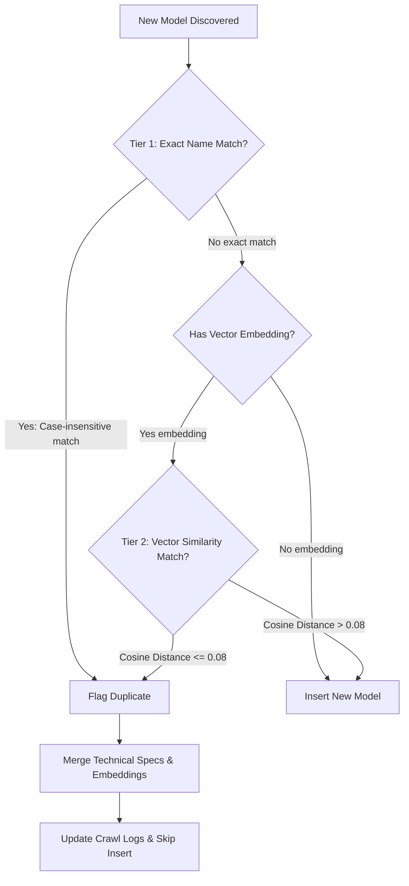
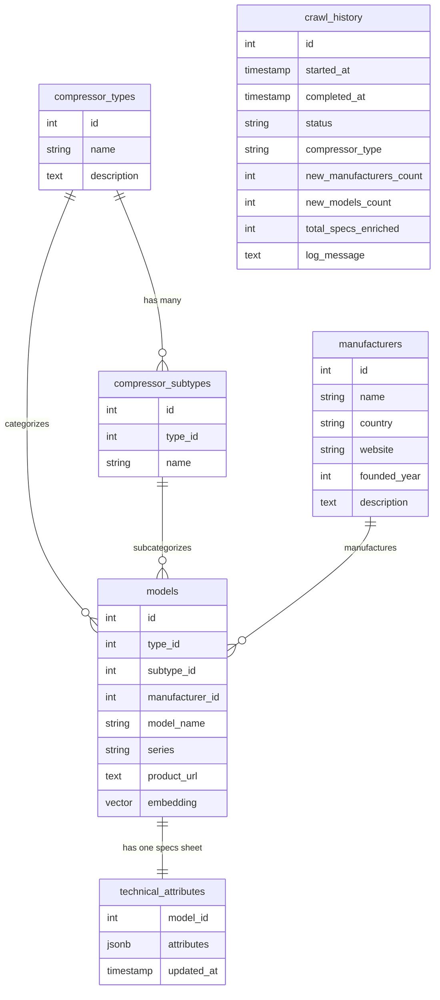

# Compressor Spec Harvester — End-to-End System Documentation

Welcome to the comprehensive technical documentation for the **Compressor Spec Harvester** system. This document serves as the single source of truth for the project architecture, data models, functional flows, and deployment commands.

---

## 🔄 1. System Architecture & Flows

The application is built on a modern decoupled architecture:
*   **Frontend**: Vue 3 + Vuetify 3 (Glassmorphism design system).
*   **Backend**: FastAPI (Python) + Background Task workers.
*   **Database**: PostgreSQL with `pgvector` for semantic similarity matching.
*   **AI Engine**: Gemini 3.1 Flash Lite via the Google GenAI SDK.

### A. End-to-End Operational Pipeline
The diagram below shows how the Vue 3 Frontend, FastAPI Backend, Database, and Gemini AI interact during background crawling, data enrichment, and catalog visualization.

```mermaid
sequenceDiagram
    autonumber
    actor User as "End User"
    participant FE as "Vue 3 / Vuetify Frontend"
    participant BE as "FastAPI API Server"
    participant DB as "PostgreSQL (pump_db)"
    participant AI as "Gemini 3.1 Flash Lite"

    %% Database Init
    User->>FE: Click "Initialize Database"
    FE->>BE: POST /api/init-db
    BE->>DB: CREATE EXTENSION vector; Create Tables
    DB-->>BE: Tables Created & Checked
    BE-->>FE: Success Notification

    %% Crawler Run
    User->>FE: Click "Start Crawling" (e.g. Air)
    FE->>BE: POST /api/crawl?compressor_type=Air
    BE-->>FE: Return Job Started (Background Task Spawned)
    
    rect rgb(20, 20, 30)
        Note over BE, AI: Background Crawling Pipeline
        BE->>DB: Insert CrawlHistory (Status: active)
        BE->>AI: Stage 1: Get Manufacturers/Brands
        AI-->>BE: Manufacturers List (JSON)
        BE->>DB: Save/Update Manufacturers
        BE->>AI: Stage 2: Discover Models for Brand
        AI-->>BE: Extract Model Names & Metadata
        Note over BE, DB: Execute Two-Tier Deduplication Check
        BE->>DB: Query exact name match OR query pgvector embeddings
        DB-->>BE: Existing Row / None
        alt Model is unique
            BE->>DB: Insert Model row
        else Model is duplicate
            BE->>DB: Link duplicate specs, Skip insertion
        end
        BE->>BE: Stage 3: Fetch spec sheets & scrape dynamic tables
        BE->>AI: Extract 30+ engineering attributes from HTML
        AI-->>BE: Structured Technical Specs JSON
        BE->>DB: Save TechnicalAttribute specs (JSONB)
        BE->>DB: Update CrawlHistory (Status: completed, new counts)
    end

    %% Fetch Catalog
    User->>FE: Open Specifications Dashboard
    FE->>BE: GET /api/compressors
    BE->>DB: Fetch Nested Category Tree
    DB-->>BE: CompressorTypes + Manufacturers + Models
    BE-->>FE: Render Interactive Specifications Grid
```

---

## 🔒 2. Two-Tier Deduplication Pipeline Flow
To eliminate duplicate `compressor_type + manufacturer + model_name` combinations, the system runs a sequential validation check:



---

## 📊 3. Database Schema (Table Structures)

The system stores structured compressor engineering specs using the PostgreSQL database schema outlined below.



### Table 1: `compressor_types`
Stores primary high-level compressor product categories (e.g. Air, Refrigeration, Gas, Medical, etc.).
*   **Columns**:
    *   `id` (`Integer`, Primary Key, Autoincrement)
    *   `name` (`String(100)`, Unique, Indexed, Not Null)
    *   `description` (`Text`, Nullable)

### Table 2: `compressor_subtypes`
Stores subtype divisions within primary categories.
*   **Columns**:
    *   `id` (`Integer`, Primary Key, Autoincrement)
    *   `type_id` (`Integer`, Foreign Key referencing `compressor_types.id` on delete `CASCADE`, Not Null)
    *   `name` (`String(100)`, Not Null)

### Table 3: `manufacturers`
Stores global brand directory entries.
*   **Columns**:
    *   `id` (`Integer`, Primary Key, Autoincrement)
    *   `name` (`String(100)`, Unique, Indexed, Not Null)
    *   `country` (`String(100)`, Nullable)
    *   `website` (`String(255)`, Nullable)
    *   `founded_year` (`Integer`, Nullable)
    *   `description` (`Text`, Nullable)

### Table 4: `models`
Tracks specific commercial model lines. Includes native vector columns for AI search and semantic parsing.
*   **Columns**:
    *   `id` (`Integer`, Primary Key, Autoincrement)
    *   `type_id` (`Integer`, Foreign Key referencing `compressor_types.id` on delete `CASCADE`, Not Null)
    *   `subtype_id` (`Integer`, Foreign Key referencing `compressor_subtypes.id` on delete `SET NULL`, Nullable)
    *   `manufacturer_id` (`Integer`, Foreign Key referencing `manufacturers.id` on delete `CASCADE`, Not Null)
    *   `model_name` (`String(150)`, Indexed, Not Null)
    *   `series` (`String(150)`, Nullable)
    *   `product_url` (`Text`, Nullable)
    *   `embedding` (`Vector(768)` or `ARRAY(Float)`, semantic text vector representing model context, Nullable)

### Table 5: `technical_attributes`
Houses the final enriched engineering properties using PostgreSQL's performance-oriented `JSONB` format.
*   **Columns**:
    *   `model_id` (`Integer`, Primary Key, Foreign Key referencing `models.id` on delete `CASCADE`)
    *   `attributes` (`JSONB`, Not Null, stores a flat dict of 30+ properties like `motor_power_kw`, `working_pressure_bar`, `lubrication_type`, `noise_level_db`, etc.)
    *   `updated_at` (`DateTime`, auto-updates on row modifications)

### Table 6: `crawl_history`
Maintains operational background job logging, telemetry metrics, and debug logs.
*   **Columns**:
    *   `id` (`Integer`, Primary Key, Autoincrement)
    *   `started_at` (`DateTime`, Not Null)
    *   `completed_at` (`DateTime`, Nullable)
    *   `status` (`String(50)`, stores `"active"`, `"completed"`, or `"failed"`)
    *   `compressor_type` (`String(100)`, Nullable)
    *   `new_manufacturers_count` (`Integer`, defaults to 0)
    *   `new_models_count` (`Integer`, defaults to 0)
    *   `total_specs_enriched` (`Integer`, defaults to 0)
    *   `log_message` (`Text`, Nullable)

---

## 🎯 4. Core Functionality

### 1. Intelligent 3-Stage Pipeline
*   **Stage 1: Manufacturer Discovery** searches global indexes via Tavily and structures manufacturers.
*   **Stage 2: Model Discovery** finds model lines via targeted queries and runs the deduplication logic.
*   **Stage 3: Deep Technical Extraction** spins up Playwright to navigate dynamic JS pages, fetches specifications text, and prompts Gemini to compile 30+ variables into schema models.

### 2. Modern Glassmorphism Vue 3 Frontend
*   **UI Clarity**: Separate labels clearly distinguish active crawling metrics (**"Brands/Models Extracted"** representing in-flight parsing) from database results (**"New Brands/Models Added"** representing unique SQL writes).
*   **Interactive Specs Matrix**: Displays structured datasheets. Includes a responsive layout with a sticky vertical database filter bar.

### 3. Standalone Database Deduplication Utility
*   The `deduplicate_db.py` script scans the active database, groups records with case-insensitive and spacing differences, scores rows for specs completeness, and safely merges duplicates back to a single master record.

---

## 💻 5. Operational Commands & Logs

Use these PowerShell commands on Windows to manage, run, and check the application:

### A. Run and Deploy
```powershell
# 1. Start the Backend API server in background, piping output to log file
python main.py --server > backend.log 2>&1

# 2. Run the Frontend Hot-Reload Development server
cd frontend
npm run dev

# 3. Compile a clean production build of frontend assets
npm run build
```

### B. Monitor Backend Logs in Real-Time
```powershell
# View and follow the running backend logs continuously in terminal
Get-Content backend.log -Wait -Tail 50
```

### C. Clean & Deduplicate Existing Database Records
```powershell
# Run the standalone DB cleanup script to merge duplicates and optimize relationships
python deduplicate_db.py
```
