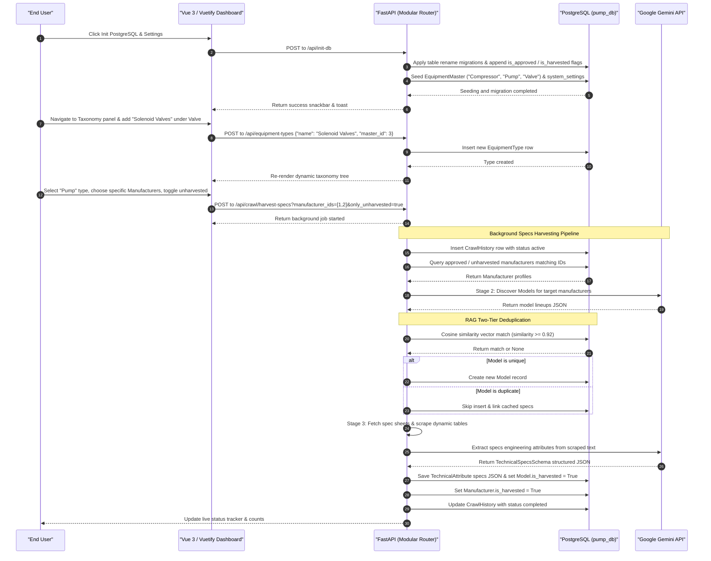
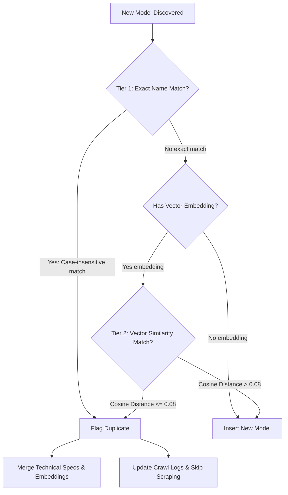
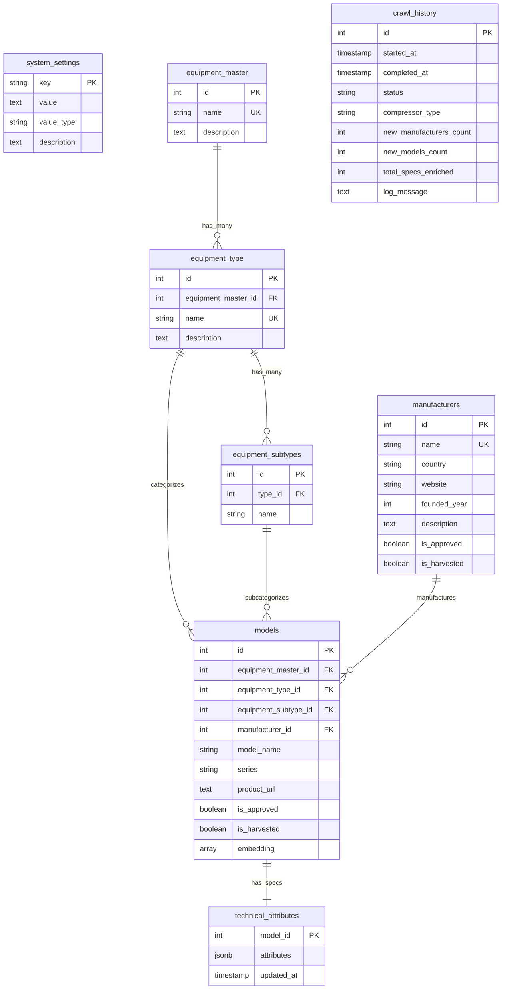

# Industrial Equipment Specs Discovery & RAG Platform — System Documentation

Welcome to the comprehensive technical documentation for the **Industrial Equipment Specs Discovery & RAG Platform**. This document serves as the single source of truth for the platform architecture, relational data models, dynamic configurations, modular packages, and operational flows.

---

## 🔄 1. System Architecture & Operational Flows

The platform is designed as an enterprise-grade, multi-category industrial equipment specifications crawler and retrieval-augmented generation (RAG) catalog. It supports diverse equipment masters (e.g. **Pumps, Compressors, Valves**) and features a decoupled architecture:

*   **Frontend**: Vue 3 + Vuetify 3 (translucent dark glassmorphism styling).
*   **Backend**: FastAPI (Python) + Background Task workers.
*   **Database**: PostgreSQL 18 with `pgvector` nearest-neighbor indexing.
*   **AI Engine**: Google Gemini (Flash series) via the new `google-genai` SDK.

### A. End-to-End Sequence Flow
The diagram below shows the interactions during database initialization, selective manufacturer harvesting, specs compilation, and taxonomy administration.



---

## 🔒 2. Two-Tier Deduplication Pipeline Flow
To eliminate duplicate `equipment_type + manufacturer + model_name` sheets, the crawler runs a sequential two-tier RAG validation check:



---

## 📊 3. Relational Database Schema

The platform maps the multi-category industrial taxonomy using a structured 3-level hierarchy linked directly to global manufacturer directories and technical specifications.



### Core Tables & Descriptions

#### 1. `system_settings`
Stores dynamic crawler quotas, Gemini model versions, and vector thresholds live inside PostgreSQL.
*   `key` (`String(100)`, Primary Key): Setting key name (e.g. `MAX_MODELS_PER_MANUFACTURER`).
*   `value` (`Text`, Not Null): Setting value saved as string.
*   `value_type` (`String(50)`): Type indicator (`int`, `float`, `bool`, `str`) for auto-type-casting.
*   `description` (`Text`): Helper descriptions.

#### 2. `equipment_master`
Stores high-level master equipment classifications.
*   `id` (`Integer`, Primary Key, Autoincrement)
*   `name` (`String(100)`, Unique, Not Null): e.g. `"Compressor"`, `"Pump"`, `"Valve"`.
*   `description` (`Text`, Nullable)

#### 3. `equipment_type` (Formerly `compressor_types`)
Stores specific equipment product categories under a master.
*   `equipment_master_id` (`Integer`, Foreign Key referencing `equipment_master.id` on delete `CASCADE`, Not Null)
*   `name` (`String(100)`, Unique, Indexed, Not Null): e.g. `"Air Compressors"`, `"Centrifugal Pumps"`.

#### 4. `equipment_subtypes` (Formerly `compressor_subtypes`)
Stores divisions and architectures under a type category.
*   `type_id` (`Integer`, Foreign Key referencing `equipment_type.id` on delete `CASCADE`, Not Null)
*   `name` (`String(100)`, Not Null): e.g. `"Scroll"`, `"Screw"`, `"Plunger"`.

#### 5. `manufacturers`
Stores global manufacturer directories.
*   `is_approved` (`Boolean`, Not Null, Default `False`): Toggle to grant crawling permission.
*   `is_harvested` (`Boolean`, Not Null, Default `False`): True if Stage 2 (model discovery) has run.

#### 6. `models`
Tracks specific commercial manufactured model lines.
*   `equipment_master_id` (`Integer`, FK referencing `equipment_master.id`)
*   `equipment_type_id` (`Integer`, FK referencing `equipment_type.id`)
*   `equipment_subtype_id` (`Integer`, FK referencing `equipment_subtypes.id`)
*   `is_approved` (`Boolean`, Default `False`): Model-level approval for frontend specs grid display.
*   `is_harvested` (`Boolean`, Default `False`): True if Stage 3 (specifications enrichment) has run.

---

## 📁 4. Modular Codebase Package Layout

To maximize maintainability and scalability, the backend was decoupled from the 760-line main script into an API router structure:

*   `main.py`: Thin CLI parser and server boot wrapper.
*   `api/router.py`: Unified registry combining all domain routing nodes.
*   `api/system.py`: Relational settings CRUD and database schema health controllers.
*   `api/taxonomy.py`: Transactional Master, Type, and Subtype taxonomy CRUD endpoints and nested tree mappings.
*   `api/manufacturers.py`: Manufacturer directory listings and website approvals.
*   `api/models.py`: Specs catalog lists, sliding drawers details, and model-level catalog approvals.
*   `api/crawler.py`: Background thread pipeline triggers and history logs.
*   `utils/crawler_orchestrator.py`: Progress state telemetry manager and background crawl handlers.
*   `tests/test_integration.py`: Fully modularized integration test package.

---

## 💻 5. Operational Commands & Logs

Use these PowerShell commands on Windows to manage, build, run, and verify the application:

### A. Run API Server & Client
```powershell
# 1. Start the backend API server reloading continuously on port 8000
python main.py --server >> backend.log 2>&1

# 2. Run the Vue 3 Vite development server on port 5173
cd frontend
npm run dev

# 3. Monitor backend uvicorn and play crawler logs in real-time
Get-Content backend.log -Wait -Tail 50
```

### B. Run the Modular Verification Suite
```powershell
# Execute the self-contained ASCII-safe database, CRUD, settings, and RAG vector test suite
python tests/test_integration.py
```

### C. Compile production Frontend Assets
```powershell
# Run Vite production asset pipeline to verify syntax safety and minification
cd frontend
npm run build
```
