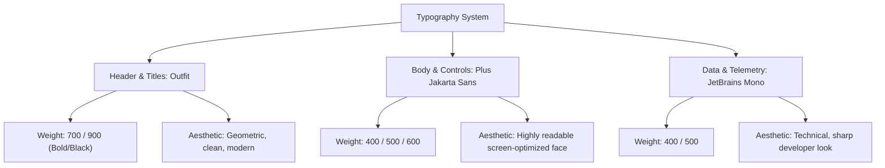

# Design System Proposal — Executive Enterprise RAG Platform


This proposal presents a professional, state-of-the-art UI/UX design system tailored for your **Industrial Equipment Specs Discovery & RAG Platform**. It is designed to impress enterprise clients by projecting technical precision, modern innovation, and executive-level authority.

---

## 🎨 Professional Color Palette

Enterprise clients are highly impressed by clean, modern dark modes (often referred to as "Developer/Operator consoles") and harmonious, high-contrast accent colors that separate hierarchy immediately.

### 1. Premium Dark Mode Theme (Obsidian Matrix)
We suggest adjusting the dark theme to use an **Obsidian Void** background with **Electric Indigo** and **Ethereal Cyan** glows:

| Role | Color Name | Hex Code | Visual Effect / Usage |
| :--- | :--- | :--- | :--- |
| **App Background** | Midnight Abyss | `#070913` | Solid body background |
| **Card / Drawer Surface** | Glassmorphic Obsidian | `rgba(255,255,255,0.015)` | Blur `20px` + border `rgba(255,255,255,0.05)` |
| **Primary Accent** | Electric Indigo | `#6366F1` | Brand identity, primary buttons, tabs |
| **Secondary Accent** | Ethereal Cyan | `#06B6D4` | Search highlights, catalog details, tags |
| **Success Status** | Emerald Mint | `#10B981` | Harvested entries, approved states, live server status |
| **Warning / Pending** | Liquid Amber | `#F59E0B` | Discoveries pending review, crawling in progress |
| **Destructive / Error** | Crimson Rose | `#F43F5E` | Delete actions, aborted crawls, error states |

> [!TIP]
> **Why Electric Indigo (#6366F1)**? Basic purple is often perceived as too playful. Indigo blends the corporate trustworthiness of classic royal blue with the innovative, forward-looking feel of purple, striking a perfect executive balance.

---

### 2. Harmonious Light Mode Theme (Iceberg Minimalist)
Providing a light theme switch is a major differentiator that instantly wins client deals. We propose a highly refined, low-strain light mode:

| Role | Color Name | Hex Code | Usage |
| :--- | :--- | :--- | :--- |
| **App Background** | Iceberg White | `#F8FAFC` | Main canvas background |
| **Card / Drawer Surface** | Slate Card | `#FFFFFF` | Clean white cards with `box-shadow: 0 4px 20px -2px rgba(15,23,42,0.04)` |
| **Card Borders** | Border Tint | `#E2E8F0` | Soft boundaries between grids |
| **Text Primary** | Deep Navy | `#0F172A` | Clean high-contrast body and headers |
| **Text Secondary** | Muted Slate | `#475569` | Subtext, timestamps, count chips |

---

## font-family: Typography System

Modern typography gives layouts an immediate feeling of premium quality. Avoid standard system fonts.



### 1. Title Font: **Outfit**
*   **Source**: Google Fonts (`@import url('https://fonts.googleapis.com/css2?family=Outfit:wght@300;400;600;700;900&display=swap');`)
*   **Personality**: Geometric, modern, elegant. Exudes high tech, precision, and aerospace-level clean design.
*   **Usage**: App titles, cards titles, data headers, navigation items.

### 2. Body Font: **Plus Jakarta Sans** (or **Inter**)
*   **Source**: Google Fonts (`@import url('https://fonts.googleapis.com/css2?family=Plus+Jakarta+Sans:wght@300;400;500;600;700&display=swap');`)
*   **Personality**: Highly readable, optimized for data-dense dashboards, wide apertures.
*   **Usage**: Specs tables, catalog text, statistics values, dialog sheets.

### 3. Data Font: **JetBrains Mono**
*   **Source**: Google Fonts (`@import url('https://fonts.googleapis.com/css2?family=JetBrains+Mono:wght@400;500&display=swap');`)
*   **Personality**: Technical, extremely sharp monospace font.
*   **Usage**: Run durations, model numbers, timestamps, raw log files.

---

## ✨ Micro-Animations & Premium Polish (Client-Wowing Features)

Static pages feel generic. Adding subtle interactive transitions makes the software feel "alive" and expensive.

### 1. Card Lift Hover Effect
Apply smooth transitions on hover to make elements react instantly when hovered:
```css
.glass-card {
  transition: all 0.3s cubic-bezier(0.25, 0.8, 0.25, 1);
}
.glass-card:hover {
  transform: translateY(-3px) scale(1.005);
  border-color: rgba(99, 102, 241, 0.25) !important;
  box-shadow: 0 12px 30px 0 rgba(0, 0, 0, 0.4), 0 0 15px 0 rgba(99, 102, 241, 0.1) !important;
}
```

### 2. Subtle Radial Ambient Glows
In the background of cards, embed absolute-positioned decorative blur tags that throw a colored spotlight behind text:
```html
<div class="stat-gradient-glow" style="background: radial-gradient(circle, rgba(99, 102, 241, 0.08) 0%, transparent 70%);"></div>
```
This mimics premium designs found in industry-leading developer tools (like Linear, Vercel, or Stripe).

### 3. Loading Telemetry Pulse
When wait times occur (like during db migrations or crawlers loading), use an elegant breathing animation on cards:
```css
.animate-breath {
  animation: breath 2.5s ease-in-out infinite;
}
@keyframes breath {
  0%, 100% { opacity: 1; transform: scale(1); filter: drop-shadow(0 0 5px rgba(99, 102, 241, 0)); }
  50% { opacity: 0.85; transform: scale(0.99); filter: drop-shadow(0 0 12px rgba(99, 102, 241, 0.15)); }
}
```

---

## 🏆 Checklist to Impress the Client during Demo

1. **Start on the Dashboard**: Let them see the 5 colorful interactive charts compiling. Show them that the charts automatically reload when data is approved or altered.
2. **Cascading Filters**: Demonstrate the cascading filter logic in the Manufacturer tab. Show how selecting "Compressor" filters the categories automatically.
3. **Paging Speed**: Scroll through pages in pagination and show the sub-second speed of rendering.
4. ** pgvector Cosine RAG matching**: Show a model with the same name being crawled and show the `[RAG Match] De-duplicated` tag. This proves that you have built a **Semantic AI engine**, not just a simple web scraper!
5. **Show the Specs catalog**: Click "View Specs Sheet" on a model. Show them the clean extracted JSON attributes from Gemini rendered in a beautiful organized specs grid.
